  

# 🛡️ Awesome Data Governance & Compliance 📊

  
  
  
  
  

> **A curated list of enterprise SaaS platforms and production-grade open-source tools for Data Governance, Data Catalogs, Metadata Management, Data Lineage, Data Quality, Privacy & Regulatory Compliance.**

---

## 📖 Table of Contents

- [☁️ SaaS / Hosted Enterprise Platforms](#%EF%B8%8F-saas--hosted-enterprise-platforms)
- [🔓 Open-Source GitHub Projects](#-open-source-github-projects)
- [🤝 How to Contribute](#-how-to-contribute)
- [⭐ Star History](#-star-history)
- [💖 Support & Sponsorship](#-support--sponsorship)
- [⚠️ Disclaimer](#%EF%B8%8F-disclaimer)

---

## ☁️ SaaS / Hosted Enterprise Platforms

> **📊 Market Size & Industry Structure**: The global data governance platform market is valued at **$750 Million in 2026** and is projected to reach **$1.2 Billion by 2030** (growing at a 12.3% CAGR). The market is **moderately fragmented**; enterprise deployments typically combine specialized tools for cataloging, privacy, and security rather than relying on a single winner-take-all vendor.

| Platform | Description | Pricing (Starting Tier) | Free Tier / Trial Limits | Company Size (Revenue / Valuation) |
| :--- | :--- | :--- | :--- | :--- |
| **[Microsoft Purview](https://www.microsoft.com/en-us/security/business/microsoft-purview)** | **Integrated Data Security & Governance Platform.** Unified data catalog, compliance management, and sensitive data discovery across M365, Azure, AWS, and hybrid multi-cloud environments. | **$1.00/GB/month** for governance data scanning + **$9.00/user/month** (Audit/Compliance add-ons) | **Free foundational tier** included with M365 E5; 30-day Azure free trial with $200 credits for pay-as-you-go workloads. | **~$281B Revenue** (Microsoft FY2025) |
| **[IBM Knowledge Catalog](https://www.ibm.com/products/knowledge-catalog)** | **Enterprise Metadata & Governance Platform.** AI-powered data cataloging, policy management, active lineage, and automatic data classification inside IBM Cloud Pak for Data. | **$1,500/month** (Enterprise cloud instances on IBM Cloud) | **30-day free trial** on IBM Cloud Lite with 10,000 catalog assets limit. | **~$63B Revenue** (IBM FY2025) |
| **[OneTrust](https://www.onetrust.com/)** | **Trust & Privacy Governance Cloud.** Market leader in privacy management, consent governance, third-party risk management, and automated data discovery. | **$10,000/year** starting subscription contract | **No permanent free tier**; 14-day guided trial available upon sales approval. | **~$5.1B Valuation** (Private) |
| **[Collibra](https://www.collibra.com/)** | **Enterprise Data Intelligence Platform.** Pioneer in data stewardship, enterprise data catalog, active metadata, and AI governance using Collibra Units (CUs). | **$170,000/year** standard enterprise base contract | **No free tier or public trial**; customized enterprise demo environment provided during evaluation. | **~$2.6B Valuation** (Private) |
| **[Alation](https://www.alation.com/)** | **Enterprise Data Catalog & Data Culture Platform.** Collaborative metadata cataloging, automated SQL query curation, active lineage, and AI Agent Studio. | **$60,000/year** base platform subscription | **No free tier**; 14-day sandbox trial available for enterprise evaluation. | **~$1.7B Valuation** (Private) |
| **[BigID](https://bigid.com/)** | **Data Intelligence & ML-Driven Classification.** Advanced data discovery, privacy compliance, DSPM, and automated sensitive data scanning across multi-cloud storage. | **$30,000/year** starting tier for mid-market deployments | **No free tier**; 30-day proof-of-concept (PoC) sandbox for qualified enterprises. | **~$1.0B Valuation** (Private) |
| **[Atlan](https://atlan.com/)** | **Modern Active Metadata & AI Context Platform.** Collaborative data catalog featuring Context Layer for AI agents, active lineage, and automated data curation. | **$40,000/year** starting subscription | **No permanent free tier**; 14-day guided trial environment available on request. | **~$100M+ ARR** (~$750M Valuation) |
| **[Informatica Cloud Data Governance](https://www.informatica.com/)** | **IDMC Data Governance & Catalog.** Enterprise metadata cataloging, lineage tracking, and data quality workflows powered by CLAIRE AI on IDMC. | **$2,000/month** (Informatica Processing Units / IPU consumption pool) | **30-day free trial** of Informatica Intelligent Data Management Cloud (IDMC). | **~$1.6B Revenue** (Private/Public) |
| **[Immuta](https://www.immuta.com/)** | **Data Security & Automated Access Control.** Attribute-based access control (ABAC), dynamic data masking, and privacy policy enforcement across cloud data platforms. | **$1.20/user/hour** on AWS/Snowflake Marketplaces | **Free tier available** on AWS/Snowflake Marketplaces (up to 5 users free forever). | **~$100M+ Funding** (Private) |
| **[Privacera](https://privacera.com/)** | **Data Security & Governance powered by Apache Ranger.** Fine-grained access control, data encryption, and compliance auditing across hybrid cloud analytical stacks. | **$1.00/year** starting listing price on AWS Marketplace | **30-day free trial** on AWS Marketplace and cloud sandbox environments. | **~$50M+ Funding** (Private) |

---

## 🔓 Open-Source GitHub Projects

Below are production-grade open-source metadata platforms, data governance frameworks, and data quality toolkits, sorted by GitHub star count in descending order.

| Repo & Description | Star Count | License | Primary Tech Stack |
| :--- | :--- | :--- | :--- |
| **[DataHub](https://github.com/datahub-project/datahub)** — **Hyperscale Real-Time Metadata Platform.** Born at LinkedIn, DataHub is the leading open-source metadata platform. Features real-time Kafka streaming metadata ingestion, column-level lineage, 80+ connectors, GraphQL/Python SDKs, and native Model Context Protocol (MCP) support for AI agents. |  | Apache-2.0 | Java / Python / React / Kafka |
| **[OpenMetadata](https://github.com/open-metadata/OpenMetadata)** — **Unified Metadata & AI-Ready Context Graph.** Single platform for data discovery, active lineage, data quality, and governance. Features built-in MCP server, semantic search, AI memory nuggets (`data-ai-sdk`), and automated policy workflows. |  | Apache-2.0 | Java / Python / TypeScript / ES |
| **[Amundsen](https://github.com/amundsen-io/amundsen)** — **Data Discovery & Metadata Engine.** Originally created at Lyft, Amundsen uses graph search to index data assets, track ownership, and display schema metadata to data analysts and engineers. |  | Apache-2.0 | Python / Neo4j / Elasticsearch |
| **[Marquez](https://github.com/MarquezProject/marquez)** — **Open Lineage Metadata Collection Engine.** The reference implementation of OpenLineage. Collects, aggregates, and visualizes complex data pipeline lineage, job execution metrics, and dataset versioning across Airflow, Spark, and dbt. |  | Apache-2.0 | Java / PostgreSQL / React |
| **[Apache Atlas](https://github.com/apache/atlas)** — **Enterprise Governance Framework for Hadoop & Big Data.** Centralized metadata management, classification-based security, data lineage, and business glossary with native integration for Hive, Spark, HBase, and Kafka. |  | Apache-2.0 | Java / JanusGraph / HBase |
| **[Apache Ranger](https://github.com/apache/ranger)** — **Comprehensive Data Security & Authorization Engine.** Framework to enable, monitor, and manage comprehensive data security across Hadoop, Spark, Trino, and cloud data platforms with centralized access policy administration. |  | Apache-2.0 | Java / Security Framework |
| **[Magda](https://github.com/magda-io/magda)** — **Federated Open Data Catalog System.** Cloud-native ecosystem for federating, indexing, and searching internal and public data catalogs across organizations with automated harvesting and spatial capabilities. |  | Apache-2.0 | TypeScript / Scala / Kubernetes |
| **[SetGo](https://github.com/ishandutta2007/Awesome-Data-Governance-Compliance)** — **Metadata Readiness & Governance Assessment Toolkit.** Python toolkit evaluating FAIR principles, governance policies, license compliance (SPDX), and data provenance with automated CI/CD readiness scoring (0-1). |  | MIT | Python / Governance CLI |

---

## 🤝 How to Contribute

Contributions are welcome! Please follow these simple guidelines:

1. 🍴 **Fork the repository**
2. 📝 **Add or update entries** in `README.md` following the tabular format.
3. 🔍 **Ensure factual accuracy**: Provide verified starting tier pricing, free limits, company sizes, or star counts.
4. 🚀 **Submit a Pull Request** with a brief summary of additions.

Read our awesome meta guide at [Awesome-Awesome-Awesome](https://github.com/ishandutta2007/Awesome-Awesome-Awesome) for contribution standards!

---

## ⭐ Star History

---

## 💖 Support & Sponsorship

If you find this curated list helpful for your enterprise architecture, research, or data engineering team, please consider supporting the project:

- ⭐ **Star this repository** to help others discover it!
- 🔀 **Fork and share** with your data engineering and compliance colleagues.
- ☕ **Buy me a coffee / Sponsor**: Support ongoing maintenance and curated data updates via [GitHub Sponsors](https://github.com/sponsors/ishandutta2007).

Thank you for being part of the open data governance community! 🙏

---

## ⚠️ Disclaimer

- This list is **community-curated** for educational and research purposes — it is not exhaustive and does not constitute formal software endorsement.
- Data governance platforms handle sensitive metadata and access controls; always perform independent security audits before deploying enterprise software.
- **Pricing & Free Limits Caveat**: All pricing estimates and trial terms reflect public disclosures as of October 2026 and are subject to change by respective vendors.
